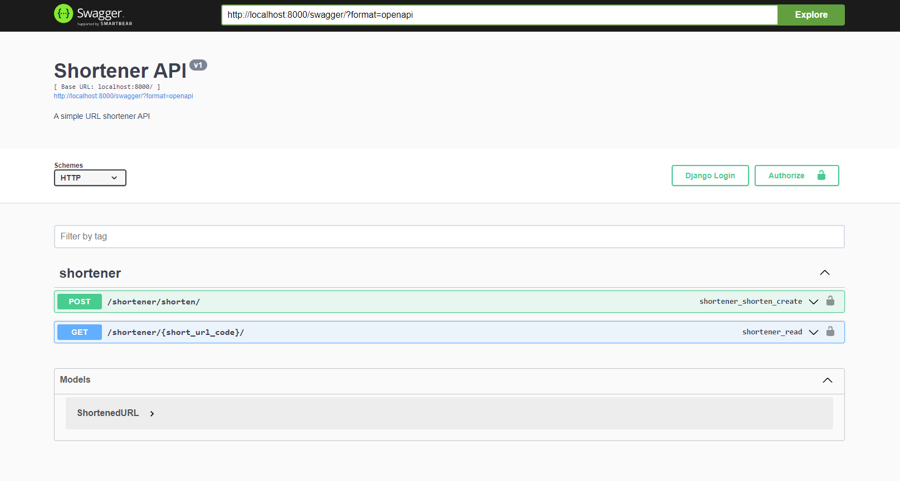

# URL Shortener API 😄🚀

Welcome to the URL Shortener API project. This is a simple Django REST framework application that allows users to shorten long URLs.



## Features 🌟

- **URL Shortening**: Convert your long URLs into short ones.
- **URL Expansion**: Expand the shortened URL back to its original form.

## Getting Started 🏃

These instructions will get you a copy of the project up and running on your local machine for development and testing purposes.

### Prerequisites 📋

- Python 3.10
- Poetry 1.5.1

### Installation 🔧

```bash
# Clone this repository
git clone https://github.com/oskarissimus/urlshortener.git

# Navigate into the repo directory
cd urlshortener

# Install dependencies using Poetry
poetry install

# Apply migrations
poetry run python manage.py migrate

# Create .env file based on .example.env and fill in the required values
cp .example.env .env
```

### Running the Server 💻

Run the Django development server

```bash
poetry run dotenv run python manage.py runserver
```

You can now access the Swagger docs at http://localhost:8000/swagger/.

## Running the Tests 🧪

You can run the test suite using the following command:

```bash
poetry run dotenv run python manage.py test
```

## Static Code Analysis 🔍

### Linting
You can run the linter (pylint) using the following command:

```bash
poetry run pylint urlshortener shortener
```

### Formatting
You can run the formatter (black + isort) using the following command:

```bash
poetry run black
```

### Type Checking
You can run the type checker (mypy) using the following command:

```bash
poetry run mypy urlshortener shortener
```

## Contenerization 🐳

You can build the Docker image using the following command:

```bash
docker build -t urlshortener .
```

You can run the Docker image using the following command:

```bash
docker run -p 8000:80 -e SECRET_KEY=secret -e DEFAULT_API_URL=http://localhost:8000 urlshortener
```

## Deployment 🚀

You can access the deployed API at https://urlshortener-eckryjl6ta-lm.a.run.app/swagger/

## Built With 🛠️

- [Django](https://www.djangoproject.com/) - The web framework used
- [Django REST framework](https://www.django-rest-framework.org/) - The REST API framework used
- [Poetry](https://python-poetry.org/) - Dependency Management
- [Docker](https://www.docker.com/) - Containerization
- [Google Cloud Run](https://cloud.google.com/run) - Deployment

